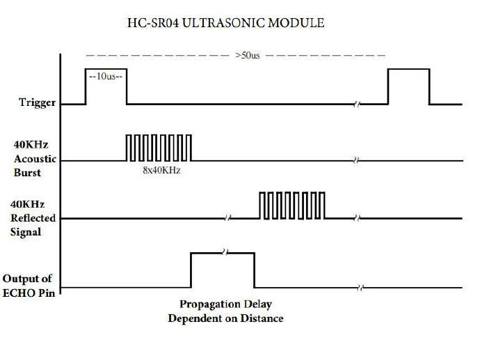
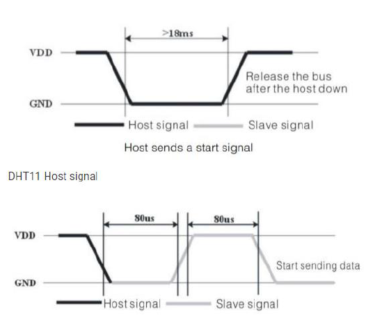
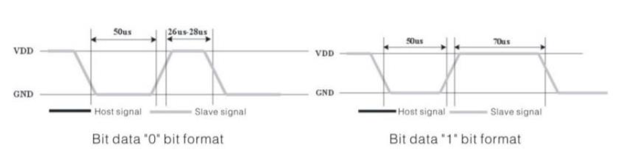

# STM32 Microcontroller

The goal of this project is the familiariazation with programming of Microcontrollers. The project  integrates an **ARM Nucleo STM32F401RE** board in an Embedding System with peripherals, such as LEDs, LCD screens, Temperature/Humidity and Distance Sensors.

The programming environment used for the development was **Keil uVision** with its tools CMSIS Core and Device Startup. Moreover the executable files were produced with the help of ARM Compiler 5 and ST-Link Debugger. The programming concerns combined compilation of **C programming** source code along with **Assembly** files.

The system aims to measure the temperature and distance of an object in order to display appropriate messages on a screen. Specifically, the ambient temperature is measured every 5 sec and after 24 measurements (2 minutes) the average temperature is displayed on the screen. In addition, the distance is measured, so that if someone approaches the system, the most recently measured temperature is displayed, as well as the previous average value. Finally, if the temperature becomes lower or higher than some thresholds, suitable LEDs light up. 

The peripherals were used for the work:

- Display: **LCD Display 16x2 Module HD44780**
- Heat and humidity sensor: **DHT11**
- Proximity sensor: **HC-SR04 Ultrasonic Module**
- **3 LEDs**, for high / low temperature indicators

## Implementation

Initially, inside main are defined the constant values that show whenever the temperature (5 sec) and the distance must be measured (1 sec arbitrarily, since it was considered a satisfactory response time), the time that the LCD must remain open (10 sec), as well as low and high temperature thresholds (23, 27, 45 º). Finally, the distance below which a message should appear on the screen is set.

It was considered particularly important to **avoid using delays** in the central repetition structure of main. Therefore, all procedures in while (1) will be performed under the guidance of a timer, which is set to interrupt every 1 sec. In the interrupt handler, 3 counters increase by 1. Specifically, there is a counter for measuring distance, one for measuring temperature and one for cleaning the LCD. Main is responsible for monitoring these three counters and the proper execution of procedures depending on their price. The LCD is powered by pin PB_0, so we can turn it off when it does not display anything to save energy. The LEDs, the LCD, the HCSR04 sensor (**HCSR04_init ()**) and the appropriate variables and arrays to be used are then initialized.

#### Iterative Processes

In regards of **while (1)**, it is firstly checked if 5 seconds have elapsed to measure the temperature. In this case the temperature sensor starts with **DHT11_start ()** and its response is checked with the **DHT11_check_response ()** function. Then 5 bytes are read by it with 5 consecutive calls of **DHT11_read ()** and the measured temperature is stored in the corresponding position of the temperature table. The temperature measurement counter is reset so that the next measurement is made in 5 seconds. At this point it is checked whether the measured temperature is above or below a threshold, so that appropriate messages appear on the screen, while one of the LEDs lights up. Finally, if the measurement made is the 24th then the average value of the table is found and displayed on the screen. The LCD counter becomes 0, so that 10 seconds are counted until it goes off.

The next function handed over by main is to measure the distance. So if one second has elapsed, the HCSR04 proximity sensor measurement is read via the **HCSR04_read ()** function. If the distance is less than a threshold, the LCD screen opens, clears and displays the current temperature as well as the previous average temperature. The LCD counter becomes 0 again, so that 10 seconds can be counted until it goes off.

The last action of main is to check if 10 seconds have passed since the last time the LCD was last updated. This is done through the LCD counter. In this case the LCD is cleaned and closed.

## Sensors Drivers

In the project that was implemented, the driver **project03Lib.c** was created, which contains functions useful for the management of the mentioned sensors.

---

### HSCR04

The proximity sensor has two power pins, a trigger_pin and an echo_pin. At first the appropriate definitions of these pins are made, which were connected to the microcontroller. The implemented functions are the **void HCSR04_init (void)**, which properly initializes the pins, and the double **HCSR04_read (void)**, which returns the distance.

    

The distance is measured by entering a pulse of 10 μsec in trigger_pin. As the pulse goes off, a pulse series propagates at 40 kHz, which is reflected and received by the sensor at echo_pin. At that moment, a pulse is generated in echo_pin, the duration of which is proportional to the measured distance. The time is measured with the help of a counter inside a while structure.

---

### DHT11

The DHT11 is a digital temperature and humidity sensor that has power supply pins and an output pin. To use the sensor, three functions were implemented. Initially, **void DHT11_start (void)** sets the pin as Output, resets it, waits 18ms and sets it as Input.

    

Next, it is advisable to check the sensor response to validate the communication. This is done with uint8_t DHT11_check_response (void), which after waiting 40 μsec checks if the pin is LOW. In this case it waits 80 μsec and checks if the pin became HIGH. If the above process is identified then the sensor is ready to send packets.

Information is sent using the uint8_t DHT11_read (void) function. This is done in 8 bit packages. For each bit we wait for dht11_pin to become HIGH. The system then delays for 40 μsec and checks the output pin value. If this is LOW then the bit received corresponds to 0. Otherwise it corresponds to 1. Finally the 8bit sequence is returned.

    

The above procedure is performed 5 times in each cycle of reading information. The first byte to be read is the integer part of the humidity, the second is the decimal part of the humidity, the third is the integer part of the temperature and the fourth is the decimal part of the temperature. Finally, the fifth byte acts as a parity byte, in order to check the successful sending or not of the packets. *At this point it should be noted that our sensor did not have decimal accuracy and so the decimal part for both quantities was always zero.*

## System Development & Testing

The development of the system followed a staggered hierarchy. First the physical connections of the circuit were implemented and the pins of the microcontroller used were declared. An independent connection and programming was done for each peripheral, in order to check the correctness of its operation. Finally, the individual circuits were connected in a single one, in order to validate the functionality of the requested application. The correct operation was validated using **Keil's Watch Window**, where it was tested if our system updates the temperature and distance measurements at the required time. At this point it should be noted that the necessary change was made to the LCD drivers, in order to display the 8bit quantities correctly.

